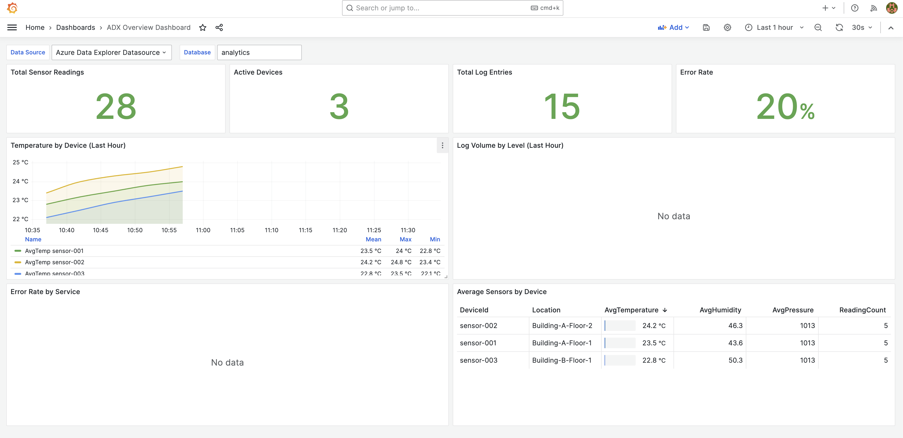

<p align="center">
  
  
</p>

<h1 align="center">ADX as a Datadog/Coralogix Alternative</h1>

<p align="center">
  <a href="#features"></a>
  <a href="#features"></a>
  <a href="#features"></a>
  <a href="#features"></a>
  <a href="LICENSE"></a>
</p>

<p align="center">
A production-ready POC demonstrating <strong>Azure Data Explorer (ADX)</strong> as a cost-effective alternative to Datadog and Coralogix for APM, logs, and metrics.<br/>
Deploy to your Azure subscription with a single command.
</p>

---

## Why ADX for Observability?

| Feature | Datadog/Coralogix | Azure Data Explorer |
|---------|-------------------|---------------------|
| **Pricing** | Per-host, per-GB ingestion | Pay for compute + storage |
| **Data Retention** | Limited (15-30 days default) | Unlimited, configurable |
| **Query Language** | Proprietary | KQL (powerful, SQL-like) |
| **Data Ownership** | Vendor-hosted | Your Azure subscription |
| **Scalability** | Vendor-managed | Auto-scale clusters |
| **Integration** | Pre-built agents | OpenTelemetry compatible |

**Cost Savings**: Organizations typically see **60-80% reduction** in observability costs when migrating from SaaS solutions to ADX.

---

## Dashboard Preview



---

## Features

- **Distributed Tracing** - Full trace context with spans, similar to Datadog APM
- **Centralized Logging** - Structured logs with full-text search
- **Infrastructure Metrics** - CPU, memory, latency, and custom metrics
- **Error Tracking** - Aggregate errors with stack traces and user impact
- **Service Map** - Visualize service dependencies
- **Alerting** - Pre-configured Grafana alerts for SLOs
- **Infrastructure as Code** - Deploy everything with Terraform

## APM Data Model

```
┌─────────────────────────────────────────────────────────────────────┐
│                        ADX APM Schema                                │
├─────────────────────────────────────────────────────────────────────┤
│                                                                      │
│  ┌─────────────┐  ┌─────────────┐  ┌─────────────┐  ┌────────────┐ │
│  │   Traces    │  │    Logs     │  │   Metrics   │  │   Errors   │ │
│  ├─────────────┤  ├─────────────┤  ├─────────────┤  ├────────────┤ │
│  │ TraceId     │  │ Level       │  │ MetricName  │  │ ErrorType  │ │
│  │ SpanId      │  │ Service     │  │ Value       │  │ StackTrace │ │
│  │ Service     │  │ Message     │  │ Service     │  │ TraceId    │ │
│  │ Operation   │  │ TraceId     │  │ Host        │  │ UserId     │ │
│  │ Duration    │  │ StackTrace  │  │ Tags        │  │ Count      │ │
│  │ Status      │  │ Attributes  │  │ Unit        │  │ Fingerprint│ │
│  │ HttpStatus  │  │ Host        │  │ Environment │  │ Attributes │ │
│  └─────────────┘  └─────────────┘  └─────────────┘  └────────────┘ │
│                                                                      │
│  ┌─────────────────────────────────────────────────────────────┐    │
│  │                      ServiceMap                              │    │
│  │  SourceService → DestinationService (latency, error rate)   │    │
│  └─────────────────────────────────────────────────────────────┘    │
└─────────────────────────────────────────────────────────────────────┘
```

## Quick Start

### Prerequisites

- Azure subscription with Contributor access
- [Terraform](https://terraform.io/downloads) >= 1.5.0
- [Azure CLI](https://docs.microsoft.com/cli/azure/install-azure-cli) >= 2.50.0

### Deploy

```bash
# Clone repository
git clone https://github.com/roy2392/adx-poc-grafana.git
cd adx-poc-grafana

# Use the helper script
./scripts/deploy.sh check   # Verify prerequisites
./scripts/deploy.sh init    # Initialize Terraform
./scripts/deploy.sh apply   # Deploy infrastructure
./scripts/deploy.sh ingest  # Load sample APM data
```

Or manually:

```bash
cd terraform

# Configure
cp terraform.tfvars.example terraform.tfvars
# Edit terraform.tfvars with your values

# Deploy
terraform init
terraform apply
```

Deployment takes ~15-20 minutes. When complete:

```bash
# Get Grafana URL
terraform output grafana_url

# Login with admin / your-configured-password
```

## Pre-built Alerts

| Alert | Condition | Severity |
|-------|-----------|----------|
| High Error Rate | Error rate > 5% for 5min | Critical |
| High P99 Latency | P99 > 1000ms for 5min | Warning |
| Low Apdex Score | Apdex < 0.7 for 10min | Warning |
| High CPU Usage | CPU > 80% for 5min | Warning |
| High Memory Usage | Memory > 85% for 5min | Warning |
| Error Spike | > 10 unique errors in 5min | Critical |

## Sample KQL Queries

### Service Health Overview
```kql
Traces
| where Timestamp > ago(1h)
| summarize
    Requests = count(),
    Errors = countif(Status == "error"),
    P95 = percentile(Duration, 95)
    by Service
| extend ErrorRate = round(100.0 * Errors / Requests, 2)
| order by ErrorRate desc
```

### Slow Requests Analysis
```kql
Traces
| where Timestamp > ago(1h) and Duration > 500
| project Timestamp, TraceId, Service, Operation, Duration, HttpUrl
| order by Duration desc
| take 50
```

### Error Breakdown
```kql
Errors
| where Timestamp > ago(1h)
| summarize Count = count(), Users = dcount(UserId) by ErrorType, Service
| order by Count desc
```

### Log Search with Context
```kql
Logs
| where Timestamp > ago(1h) and Level in ("ERROR", "FATAL")
| project Timestamp, Service, Level, Message, TraceId, StackTrace
| order by Timestamp desc
```

## Architecture

```
┌─────────────────────────────────────────────────────────────┐
│                      Azure Subscription                      │
├─────────────────────────────────────────────────────────────┤
│  ┌─────────────────┐         ┌─────────────────┐            │
│  │  Azure Data     │◄────────│    Grafana      │            │
│  │  Explorer       │         │    (ACI)        │            │
│  │  Cluster        │         │  + ADX Plugin   │            │
│  └────────┬────────┘         │  + Alerts       │            │
│           │                  └─────────────────┘            │
│  ┌────────▼────────┐  ┌──────────────┐  ┌──────────────┐   │
│  │  ADX Database   │  │   Storage    │  │  Key Vault   │   │
│  │  - Traces       │  │   Account    │  │  (Secrets)   │   │
│  │  - Logs         │  └──────────────┘  └──────────────┘   │
│  │  - Metrics      │                                        │
│  │  - Errors       │                                        │
│  │  - ServiceMap   │                                        │
│  └─────────────────┘                                        │
└─────────────────────────────────────────────────────────────┘
```

## Integration Guide

### OpenTelemetry

ADX is fully compatible with OpenTelemetry. Configure your OTLP exporter to send data to ADX:

```yaml
# otel-collector-config.yaml
exporters:
  azuredataexplorer:
    cluster_uri: https://your-cluster.eastus.kusto.windows.net
    database: analytics
```

### Existing Application Instrumentation

If you're already using Datadog or similar:

1. **Traces**: Export to OTLP format → ADX
2. **Logs**: Configure log forwarder → ADX ingestion
3. **Metrics**: Use ADX metrics ingestion API

## Project Structure

```
adx-poc-grafana/
├── README.md                    # This file
├── assets/                      # Images and screenshots
├── dashboards/                  # Grafana dashboard JSON files
│   ├── apm-overview.json        # Main APM dashboard
│   └── alerts.json              # Alert rule definitions
├── docs/                        # Documentation
│   ├── PLAN.md                  # Implementation plan
│   ├── ARCHITECTURE.md          # Detailed architecture
│   ├── DEPLOYMENT.md            # Step-by-step deployment guide
│   └── TERRAFORM.md             # Terraform reference
├── sample-data/                 # Sample APM data
│   ├── traces.json              # Distributed traces
│   ├── logs.json                # Application logs
│   ├── metrics.json             # Infrastructure metrics
│   ├── errors.json              # Error tracking data
│   └── service-map.json         # Service dependencies
├── scripts/                     # Helper scripts
│   ├── deploy.sh                # Deployment automation
│   └── generate-apm-data.py     # Generate sample APM data
└── terraform/                   # Infrastructure as Code
    ├── main.tf
    ├── variables.tf
    ├── outputs.tf
    └── modules/
        ├── adx/                 # ADX cluster & APM schema
        ├── grafana/             # Grafana container
        └── networking/          # VNet (optional)
```

## Cost Estimate

| Resource | Monthly Cost (Est.) |
|----------|---------------------|
| ADX Cluster (Dev SKU) | ~$150 |
| Container Instance | ~$30 |
| Storage & Key Vault | ~$6 |
| **Total** | **~$186** |

**Production Scaling**: For production workloads with 100GB/day ingestion, expect ~$800-1200/month (vs $5000+ for equivalent Datadog capacity).

## Documentation

| Document | Description |
|----------|-------------|
| [Implementation Plan](docs/PLAN.md) | High-level plan, phases, and milestones |
| [Architecture](docs/ARCHITECTURE.md) | Detailed component architecture |
| [Deployment Guide](docs/DEPLOYMENT.md) | Step-by-step deployment instructions |
| [Terraform Reference](docs/TERRAFORM.md) | Terraform modules and configuration |

## Cleanup

```bash
# Using helper script
./scripts/deploy.sh destroy

# Or manually
cd terraform
terraform destroy
```

## License

MIT
